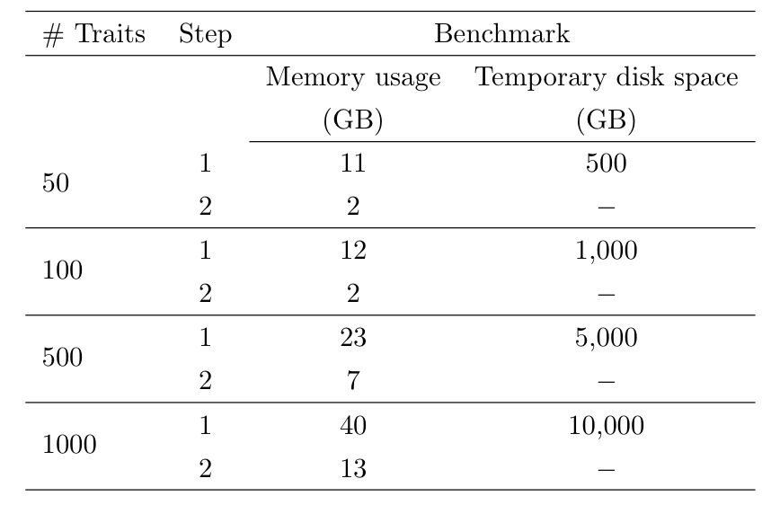

## Recommendations for UK Biobank analysis

**regenie** is ideally suited for large-scale analyses such as 500K UK
Biobank (UKBB) data, where records are available for thousands of phenotypes.

We provide below a few guidelines on how to perform such analysis on
the UKBB files that all UKBB approved researchers have access to.

### Pre-processing

We will first go over important steps to consider before running **regenie**.

#### Selection of traits

**regenie** can perform whole genome regression on multiple traits at once, which is where
higher computational gains are obtained.

As different traits can have distinct missing patterns, **regenie** uses an imputation scheme
to handle missing data.
From the real data applications we have performed so far with traits having up to ~20% (for quantitative) 
and ~5% (for binary) missing observations, our imputation scheme resulted in 
nearly identical results as from discarding missing observations when analyzing each trait 
separately (see the [BioRxiv pre-print](https://www.biorxiv.org/content/10.1101/2020.06.19.162354v1) for details). 
Hence, we recommend to analyze traits in groups that have similar missingness patterns with resonably 
low amount of missingness (<15%).


The number of phenotypes in a group will affect the computational resources required
and the table below shows typical computational requirements based on using 
500,000 markers in step 1 split in blocks of 1000 and using blocks of size 200 when 
testing SNPs in step 2. The estimates are shown when step 1 of **regenie** is run in low-memory mode 
so that within-block predictions are temporarily stored on disk (see Documentation).

{ style="text-align:center;padding: 10px;width:50%;display: block;margin-left: auto;margin-right: auto"}

In the following sections, we'll assume traits (let's say binary) and covariates 
used in the analysis have been chosen and data are in files
`ukb_phenotypes_BT.txt` and `ukv_covariates.txt`,
which follow the format requirement for **regenie** (see Documentation).

#### Preparing genotype file

Step 1 of a **regenie** run requires a single genotype file as input. 
The UKBB genotype files are split by chromosome, so we recommend using
[PLINK](http://www.cog-genomics.org/plink/) to merge the files using the following code.

*NOTE*: please change **XXX** to you own UKBB application ID number
```
rm -f list_beds.txt
for chr in {2..22}; do echo "ukb_cal_chr${chr}_v2.bed ukb_snp_chr${chr}_v2.bim ukbXXX_int_chr1_v2_s488373.fam\n" >> list_beds.txt; done

plink \
  --bed ukb_cal_chr1_v2.bed \
  --bim ukb_snp_chr1_v2.bim \
  --fam ukbXXX_int_chr1_v2_s488373.fam\
  --merge-list list_beds.txt \
  --make-bed --out ukb_cal_allChrs
```


#### Exclusion files

Quality control filters can be applied using [PLINK2](https://www.cog-genomics.org/plink/2.0/) to filter out samples and
markers in the genotype file prior to step 1 of **regenie**. For example, to filter out SNPs with MAF below 5%, genotype missingess 
above 10% and Hardy-Weinberg equilibrium p-value exceeding \(10^{-15}\), and 
samples with more than 10% missingness,

```
plink2 \
  --bfile ukb_cal_allChrs \
  --maf 0.05 --geno 0.1 --hwe 1e-15 \
  --mind 0.1 \
  --write-snplist --write-samples --no-id-header \
  --out qc_pass
```


### Step 1

We recommend to run **regenie** using multi-threading (8+ threads) which will 
decrease the overall runtime of the program. 
As this step can be quite memory intensive (due to storing block predictions), 
we recommend to use option `--lowmem`, where the number of phenotypes analyzed
will determine how much disk space is required (see table above).

Running step 1 of **regenie** (by default, all available threads are used)

```
./regenie \
  --step 1 \
  --bed ukb_cal_allChrs \
  --extract qc_pass.snplist \
  --keep qc_pass.id \
  --p ukb_phenotypes_BT.txt \
  --c ukv_covariates.txt \
  --bt \
  --b 1000 \
  --lowmem tmpdir/regenie_tmp_preds \
  --o ukb_step1_BT
```

For P phenotypes analyzed, this will generate a set of $P$ files ending with `.loco`
which contain the genetic predictions using a LOCO scheme that will be needed for step 2,
as well as a prediction list file `ukb_step1_BT_pred.list`, which lists 
the names of these predictions files and can be used as input for step 2.


### Step 2

As step 1 and 2 are completely decoupled in **regenie**, you could either use all 
the traits for testing in step 2 or select a subset of the traits to perform association testing.


Step 2 of **regenie** has been optimized to run multi-threaded for BGEN files that are in v1.2+ format with 8-bit encoding (which is the format of the UKBB imputed data), PLINK bed/bim/fam files, and PLINK2 pgen/pvar/psam files. We recommend that you use files in one of these formats. Also, step 2 can be run in parallel across chromosomes so if you have access to multiple
machines, we recommend to split the runs over chromosomes (using 8+ threads).

#### Sample mismatch 

It may be that the genotype file used in step 2 does not contain all of the samples used in step 1 
or contains additional samples not used in step 1. 
In such a case, you could for example use the following code to only retain samples that are 
contained in both data sets (we assume that you are testing on BGEN input file)

```
expand -t 1 qc_pass.id > qc_pass_space.id   # BGEN sample file is space-seperated
grep -wFf qc_pass_space.id ukbXXX_imp_chr1_v3_s487395.sample > fid_iid_step2.keep
```

Running **regenie** tesing on a single chromosome (here chr 1) and using fast Firth correction as fallback,

```
./regenie \
  --step 2 \
  --bgen ukb_imp_chr1_v2.bgen \
  --keep fid_iid_step2.keep \
  --p ukb_phenotypes_BT.txt \
  --c ukv_covariates.txt \
  --bt \
  --firth 0.01 --approx \
  --pred ukb_step1_BT_pred.list \
  --b 400 \
  --split \
  --o ukb_step2_BT_chr1

```

This will create separate association results files for each phenotype as `ukb_step2_BT_chr1_*.regenie`.

